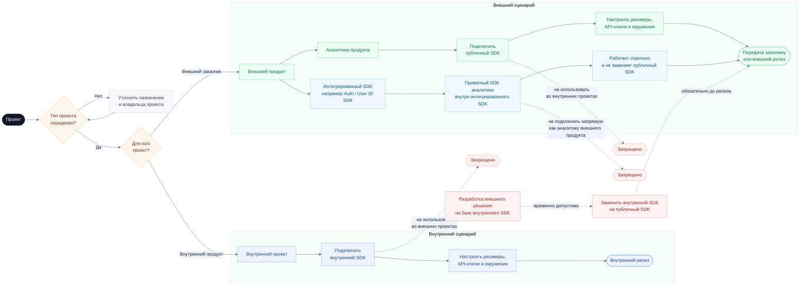

# Выбор SDK для проекта

В проекте используются две версии SDK аналитики:

| Версия SDK | Назначение | Где использовать |
| --- | --- | --- |
| Внутренний SDK | SDK для внутренних продуктов и команд компании. Также может использоваться как базовый SDK на этапе разработки решений для внешних заказчиков. | Только внутренние проекты. |
| Публичный SDK | SDK для интеграции аналитики во внешние клиентские проекты. | Только внешние проекты. |

Основное правило: внутренний SDK не подключается во внешние проекты, а публичный SDK не используется во внутренних проектах.

Если решение для внешнего заказчика на раннем этапе разрабатывалось на базе внутреннего SDK, перед передачей заказчику или внешним релизом необходимо заменить его на публичный SDK.

Отдельный допустимый кейс: во внешнем продукте может быть подключен другой SDK, например Auth SDK или User ID SDK, внутри которого уже используется приватный SDK аналитики. Такая аналитика относится к внутренней реализации этого SDK и работает отдельно. При этом сам внешний продукт все равно должен подключать публичный SDK аналитики для своих событий.

## Порядок использования

1. Определите тип проекта до подключения SDK.
2. Для внутреннего проекта подключите внутренний SDK.
3. Для внешнего проекта подключите публичный SDK.
4. Если внешний проект был начат на базе внутреннего SDK, замените его на публичный SDK до передачи заказчику или внешнего релиза.
5. Если внешний проект использует SDK со встроенной приватной аналитикой, например Auth SDK или User ID SDK, оставьте эту аналитику внутри такого SDK и не используйте ее как аналитику внешнего продукта.
6. После выбора SDK настройте ресиверы, API-ключи и окружения согласно инструкции подключения.
